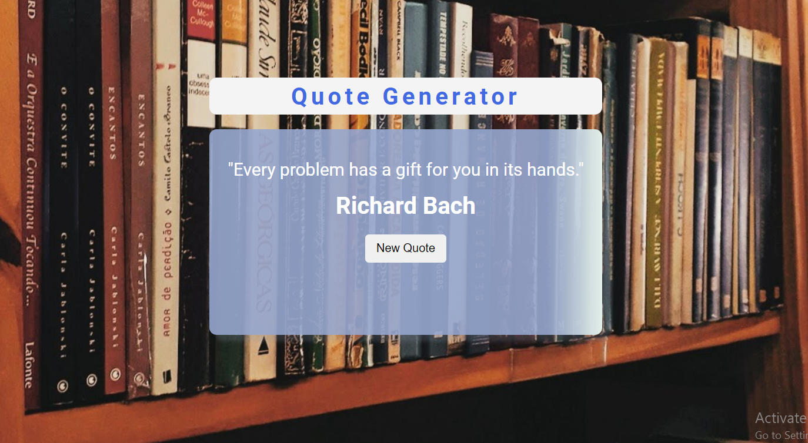

# Quote Generator

This is a simple web application that generates random quotes using an API.

## Features

- Fetches quotes from the [Type.fit API](https://type.fit/api/quotes).
- Displays a random quote with each button click.
- Shows the quote's author along with the text.

<!-- ## Demo

You can try out the live demo of the shopping list application [here](https://example.com). -->

## Screenshots

<!--  -->

## Technologies Used

- HTML
- CSS
- JavaScript
